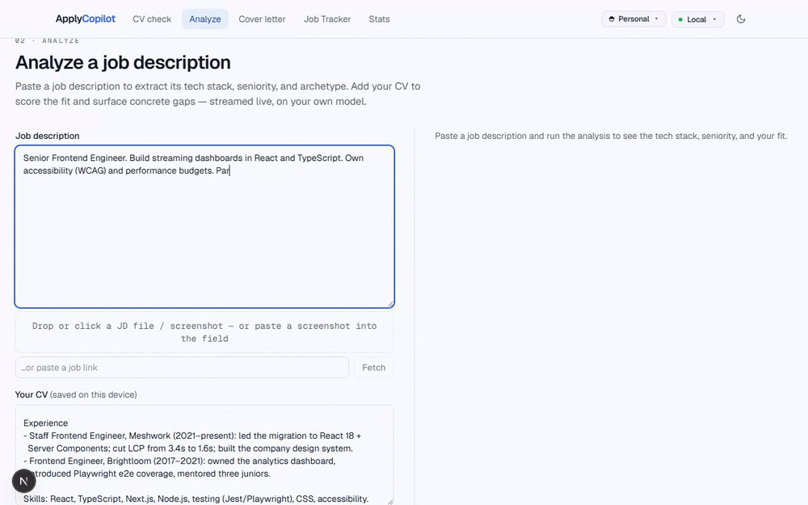

---

I own frontend architecture for high-traffic products. At **DreamHost** (remote, US)
I cut the customer control-panel's bug backlog by **50%+ (150+ issues resolved)** by
re-architecting legacy modules and setting shared standards, lifted a core user flow's
**completion rate by 17%**, and ran release safety (Datadog RUM) and the GA3 → GA4
analytics migration for a panel serving **100k+ monthly users**.

- 🔭 5+ years in frontend; 3+ owning frontend architecture
- 🧱 Built a **runtime-mounted micro-frontend** control panel: 45+ React 18 modules
      mounted into a legacy host at runtime, talking to backend microservices over REST
- ⚡ Performance & reliability: Core Web Vitals, bundle optimization, Datadog RUM
      release monitoring, incident response & rollback calls
- 📊 Led GA3 → GA4 migration: custom events, funnels, release validation
- 🎓 Pursuing an MSc in Computer Science (AI/ML track)
- 📍 Bucharest, Romania · open to remote (EU) and relocation
- 💬 Ukrainian (native) · English (B2) · Russian (C1)

## Tech

## Featured

**🤖 [Apply Copilot](https://github.com/Erebus1678/apply-copilot)** — newest build

Paste a job description and it extracts the tech stack, seniority and role
archetype; scores the fit against your CV with a concrete gap list; drafts a
tailored cover letter; and tracks every application on a persistent pipeline
board. The AI layer is provider-agnostic — the same code runs against a local
model (LM Studio, Ollama) or any cloud provider with your own key — and it ships
with an embedded database, so there is nothing to set up.

  

`Next.js` · `React 19` · `TypeScript` · `Tailwind v4` · `streaming AI` · `PGlite`

| Also on my profile | |
| :-- | :-- |
| **[Crypto Exchange](https://github.com/Erebus1678/next-mobx-crypto-exchange)** · [live](https://next-mobx-crypto-exchange.vercel.app) | Real-time crypto converter · Next.js 15 · React 19 · MobX · MUI · Zod |
| **[Imaginify](https://github.com/Erebus1678/imaginify)** · [live](https://imaginify-tan-tau.vercel.app/) | AI image-editing SaaS · Next.js 14 · Cloudinary AI · Clerk · Stripe · MongoDB |
| **[FSD React Template](https://github.com/Erebus1678/fsd-react-template)** | Production React starter on Feature-Sliced Design · TS · Vite · Tailwind · Zustand |
| **[Portfolio](https://github.com/Erebus1678/portfolio)** | This site · Next.js · TypeScript · Tailwind · Framer Motion |

## Reach me

[LinkedIn](https://linkedin.com/in/dmitryi-platov) · dmitryi.platov@gmail.com
